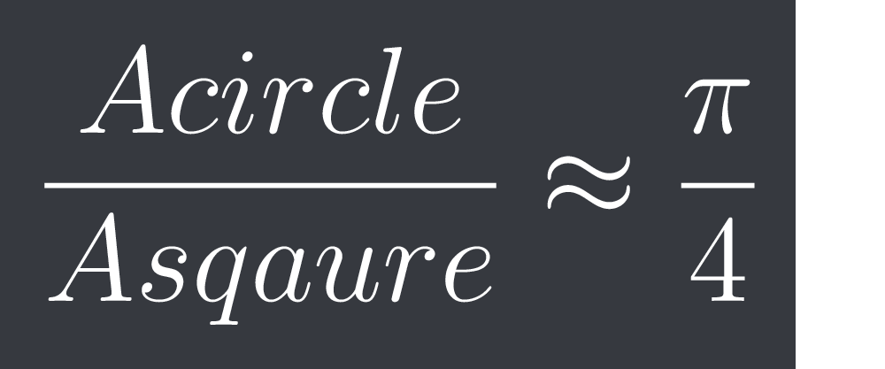

# SlowPiApproximation
4 times the area of the unit circle divided by the area of the unit square

# How it works
Using 

we can approximate pi over 4. In order to get the areas we randomly plot points and use the total number of points in the circle and square as the area. When you multiply by 4 you get pi.

